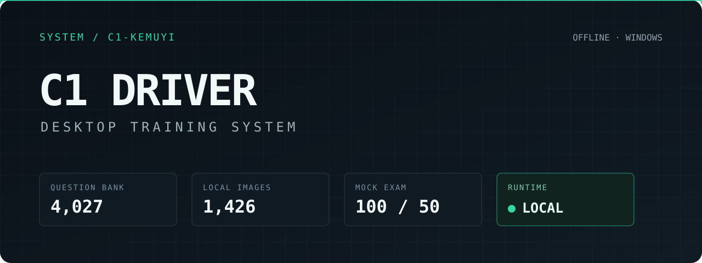
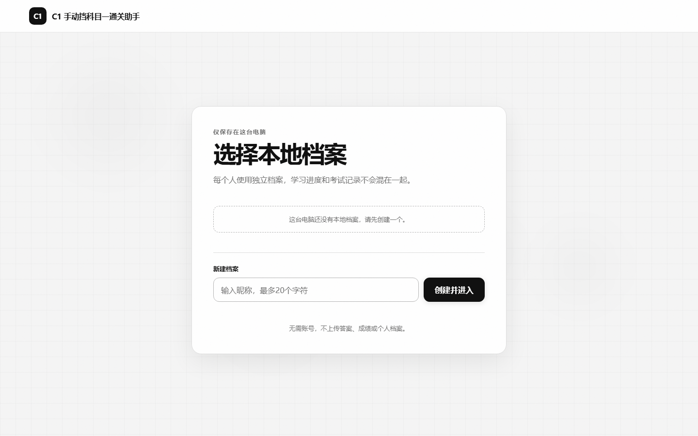

<p align="center">
  <strong>
    <a href="README.md">中文</a> ·
    <a href="README.ja.md">日本語</a> ·
    <a href="README.en.md">English</a>
  </strong>
</p>

<p align="center">
  <strong>
    <a href="https://github.com/ace865/c1-kemuyi-web/releases/latest">下载</a> ·
    <a href="#快速开始">开始使用</a> ·
    <a href="https://github.com/ace865/c1-kemuyi-web/issues">问题反馈</a> ·
    <a href="#参与开发">参与开发</a>
  </strong>
</p>

<p align="center">
  <a href="https://github.com/ace865/c1-kemuyi-web/releases/latest"></a>
  
  
  
  <a href="LICENSE"></a>
  <a href="https://github.com/ace865/c1-kemuyi-web/pulls"></a>
</p>

<h1 align="center">欢迎使用 C1 驾考通关助手</h1>

这是一个面向 Windows 的 C1 科目一 / 科目四离线学习工具。应用内置科目一 2,194 题、科目四 1,833 题及 1,426 张配图；两科进度独立保存，数据只留在本机。

项目使用原生 HTML、CSS 和 JavaScript 构建界面，以 Electron 提供桌面运行环境。没有账号系统，也不依赖远程题库或在线接口。

## 把练习、考试和复盘放在一起

顺序、随机、错题和专项练习覆盖单选、判断与多选题。科目一模考为 100 题 / 45 分钟，科目四为 50 题 / 30 分钟，均以 90 分为合格线，并保留最近 20 场记录供逐题复盘。

应用会自动遵循 Windows 的“减少动画”偏好；也可在“我的”中手动开启。开启后页面、卡片、计数、Toast、粒子和彩纸不再播放位移或缩放动画，答题颜色、边框、图标、文字和紧急计时状态仍会保留。

<p align="center">
  
</p>

## 快速开始

普通用户可从 **[Releases](https://github.com/ace865/c1-kemuyi-web/releases/latest)** 下载 Windows 安装包。源码运行需要 [Node.js 22+](https://nodejs.org/)：

```powershell
npm install
npm start
```

浏览器预览：

```powershell
node scripts/serve-local.mjs
# http://127.0.0.1:8080
```

## 参与开发

欢迎提交题库勘误、缺陷修复、界面改进、翻译和文档更新。请从独立分支发起 Pull Request，不要直接修改 `main`；提交前运行：

```powershell
npm run check
```

完整开发流程见 [CONTRIBUTING.md](CONTRIBUTING.md)，题库、依赖与发布维护见 [MAINTENANCE.md](MAINTENANCE.md)，安全问题请按 [SECURITY.md](SECURITY.md) 私密报告。

发现问题但暂时不方便写代码，也可以直接 **[创建 Issue](https://github.com/ace865/c1-kemuyi-web/issues/new)**，附上复现步骤、系统版本和截图。

## 构建

```powershell
npm run dist:win
```

该命令会生成图标、检查离线资源、运行自动化测试，并在 `release/` 输出 Windows NSIS 安装包。

## 项目结构

```text
index.html
|-- src/data/                    offline question bank
|-- src/assets/question-images/  local question images
|-- src/js/                      practice, exam, storage, motion
|-- desktop/                     Electron main process
|-- scripts/                     build and integrity checks
`-- tests/                       Node.js tests
```

## 说明

本项目是非官方学习工具。法规、题目和考试规则可能调整，请以当地主管部门发布的最新信息为准。

## 开源协议

原创程序代码与原创文档采用 [MIT License](LICENSE)。题库数据和题目图片不自动包含在 MIT 授权范围内，详情见 [NOTICE.md](NOTICE.md)。
